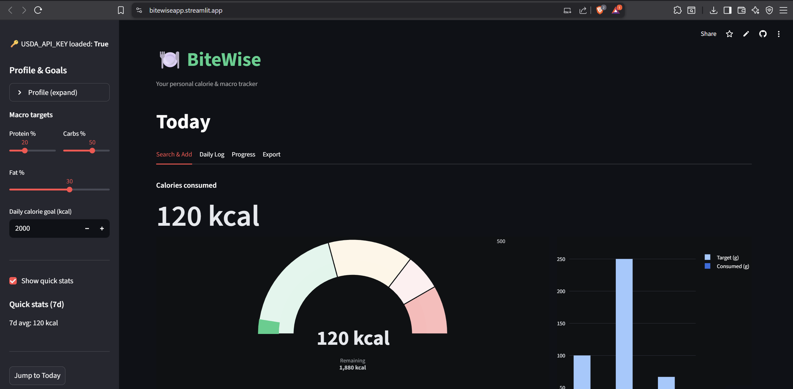
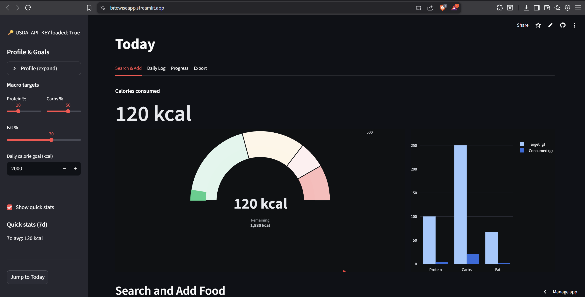
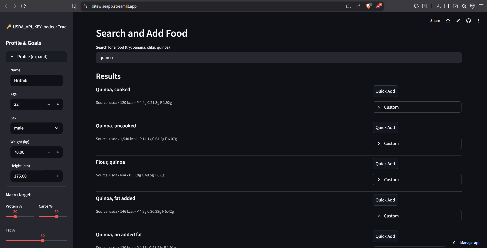
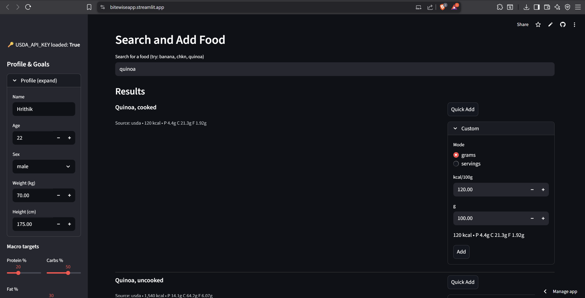
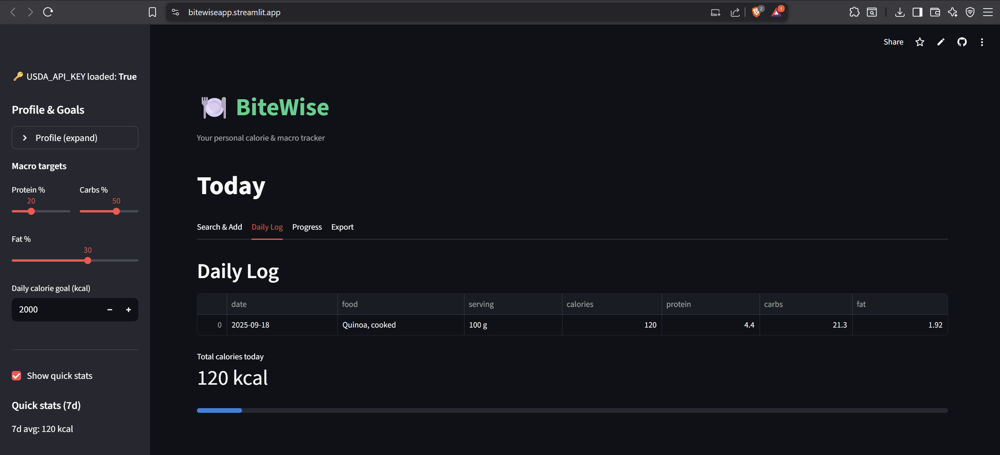
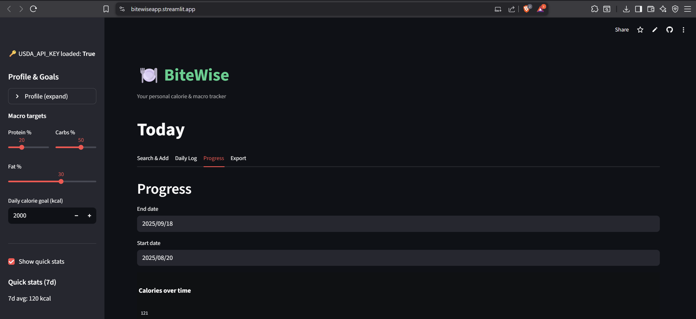
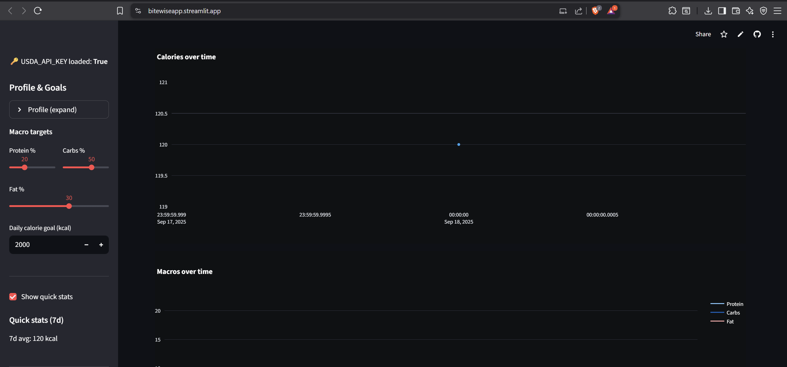
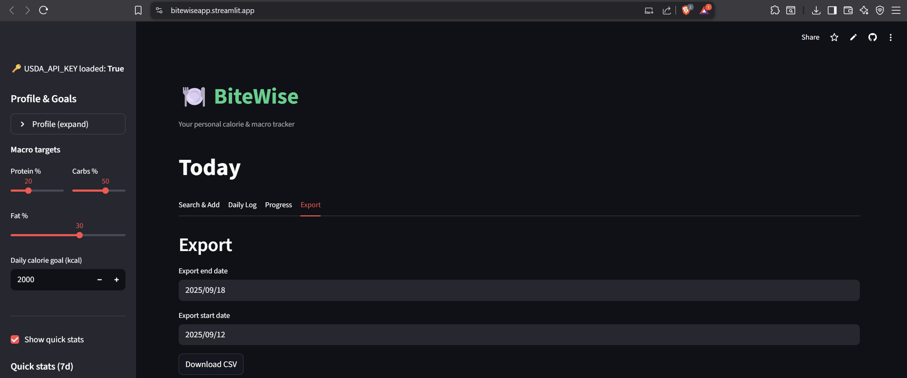

Food & Calorie Tracker

A simple and interactive Streamlit app that lets you search for foods, explore their ingredients, and check nutritional values (calories, protein, carbs, fat). Built with Python, Pandas, Streamlit, and Plotly.

Features

-Search foods by name
-Food details (ingredients, diet type, course, region, state)
-Nutrition breakdown (calories + macros)
-Macro pie chart visualization

Fast and interactive web app powered by Streamlit

Getting Started
1. Clone the repo
git clone https://github.com/<your-username>/food-calorie-tracker.git
cd food-calorie-tracker

2. Create virtual environment
python -m venv .venv
source .venv/bin/activate      # Linux/Mac
.venv\Scripts\Activate.ps1     # Windows PowerShell

3. Install dependencies
pip install -r requirements.txt

4. Build dataset
python src/build_dataset.py

5. Run app
streamlit run src/app.py

Open your browser → http://localhost:8501

Example Output

Search: Paneer
Ingredients: Paneer, tomato, cream, butter
Calories: 350 kcal
Protein: 12 g
Carbs: 18 g
Fat: 28 g
(screenshot placeholder)

Tech Stack:

Python 3.12+
Pandas (data processing)
Streamlit (web app)
Plotly (charts)
Matplotlib (EDA)

Deployment:

You can deploy this on:
Streamlit Cloud (fastest, free option)

## Output Screen Shots:

